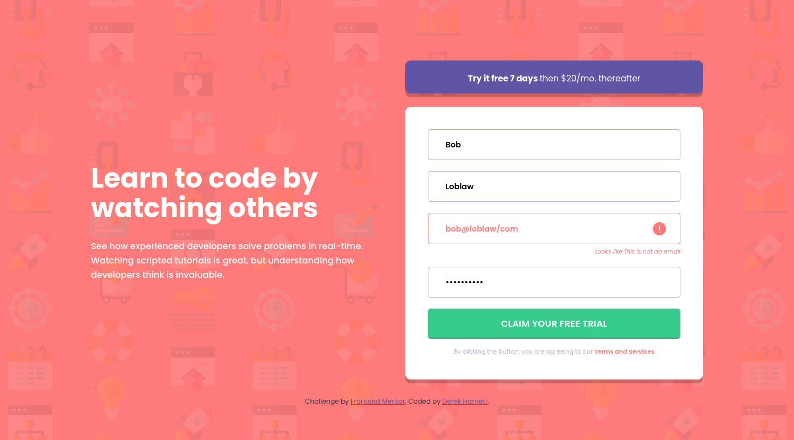

# Frontend Mentor - Intro component with sign up form solution

This is a solution to the [Intro component with sign up form challenge on Frontend Mentor](https://www.frontendmentor.io/challenges/intro-component-with-signup-form-5cf91bd49edda32581d28fd1). Frontend Mentor challenges help you improve your coding skills by building realistic projects.

## Table of contents

- [Overview](#overview)
  - [The challenge](#the-challenge)
  - [Screenshot](#screenshot)
  - [Links](#links)
- [My process](#my-process)
  - [Built with](#built-with)
  - [What I learned](#what-i-learned)
  - [Continued development](#continued-development)
  - [Useful resources](#useful-resources)
- [Author](#author)
- [Acknowledgments](#acknowledgments)

## Overview

### The challenge

Users should be able to:

- View the optimal layout for the site depending on their device's screen size
- See hover states for all interactive elements on the page
- Receive an error message when the `form` is submitted if:
  - Any `input` field is empty. The message for this error should say *"[Field Name] cannot be empty"*
  - The email address is not formatted correctly (i.e. a correct email address should have this structure: `name@host.tld`). The message for this error should say *"Looks like this is not an email"*

### Screenshot



### Links

- Solution URL: [https://github.com/harnettd/intro-component-signup-form](https://github.com/harnettd/intro-component-signup-form)
- Live Site URL: [https://harnettd.github.io/intro-component-signup-form/](https://harnettd.github.io/intro-component-signup-form/)

## My process

### Built with

- HTML
- CSS including Flexbox
- JavaScript

### What I learned

This is the first Frontend Mentor project that I worked on that asked for significant client-side form validation. To do so, I added an event listener to the submit button that checked for validity the values of each of the input elements:

```js
form.addEventListener("submit", function (evt) {
  evt.preventDefault();

  if (firstName.value === "") {
    addOnErr(firstName);
  } else {
    removeOnErr(firstName);
  }

  ...

}
```

It's also the first time that I needed to use regular expressions in JavaScript. To check the validity of an email address, I used the following:

```js
const isValidEmail = (email) => {
  const emailRegexp = /^\w+(\.\w+)*@\w+(\.\w+)*$/g;
  if (email.match(emailRegexp) === null) {
    return false;
  }
  return true;
};
```

Apparently, valid email addresses can be even more complicated than what's allowed for with the above regular expression, but this covers the vast majority of email addresses I've seen.

This is also the first time that I've made use of the focus and blur events, adding and removing CSS classes as needed:

```js
  input.addEventListener("focus", () => {
    removeOnErr(input);
    container.classList.add(focusClass);
  });

  input.addEventListener("blur", () => {
    container.classList.remove(focusClass);
  });
```

### Continued development

The key new ideas that I encountered on this project are HTML forms and client-side form validation. I'd like to dig deeper into how best to handle UX/UI considerations and provide useful visual cues and feedback to users.

### Useful resources

- [Regular Expressions](https://developer.mozilla.org/en-US/docs/Web/JavaScript/Guide/Regular_expressions) - This is the page that I read in order to build a JavaScript regular expression that would match a (fairly) arbitrary email address.
- [:focus](https://developer.mozilla.org/en-US/docs/Web/CSS/:focus) - This is the resource I read to help me add appropriate styles to an input and its relevant relatives when the input gained focus.

## Author

- Github - [harnettd](https://github.comharnettd)
- Frontend Mentor - [@harnettd](https://www.frontendmentor.io/profile/harnettd)

## Acknowledgments

As always, thanks to the people at [Frontend Mentor](https://www.frontendmentor.io) for posting this challenge. Also, thanks to [@skyv26](https://www.frontendmentor.io/profile/skyv26) and [@markuslewin](https://www.frontendmentor.io/profile/markuslewin) for their helpful comments on my original submission.
